# Brazilian E-Commerce Data Pipeline - Architecture Documentation

## Table of Contents
1. [System Architecture Overview](#system-architecture-overview)
2. [Data Flow Architecture](#data-flow-architecture)
3. [dbt Model Lineage](#dbt-model-lineage)
4. [Dagster Orchestration Flow](#dagster-orchestration-flow)
5. [BigQuery Schema Design](#bigquery-schema-design)
6. [Infrastructure Architecture](#infrastructure-architecture)
7. [Security Architecture](#security-architecture)

---

## System Architecture Overview

### High-Level Architecture


### Technology Stack


---

## Data Flow Architecture

### End-to-End Data Pipeline


### Data Quality & Idempotency Flow


---

## dbt Model Lineage

### Complete dbt DAG


### Staging Layer Details


### Warehouse Layer Details


---

## Dagster Orchestration Flow

### Asset Dependency Graph


### Dagster Asset Materialization

```mermaid
sequenceDiagram
    participant UI as Dagster UI
    participant Dag as Dagster Engine
    participant Kag as Kaggle API
    participant GCS as Cloud Storage
    participant BQ as BigQuery
    participant dbt as dbt Core

    UI->>Dag: Materialize All Assets
    Dag->>Kag: Download dataset
    Kag-->>Dag: CSV files (9 files)

    par Optional GCS Upload
        Dag->>GCS: Upload raw files
        GCS-->>Dag: Upload complete
    end

    Dag->>BQ: Load CSV to raw tables
    BQ-->>Dag: Tables created (9 tables + metadata)

    Dag->>dbt: dbt run --select staging
    dbt->>BQ: Create staging views
    BQ-->>dbt: 7 views created
    dbt-->>Dag: Staging complete

    Dag->>dbt: dbt run --select warehouse
    dbt->>BQ: Create warehouse tables
    BQ-->>dbt: 6 tables created
    dbt-->>Dag: Warehouse complete

    Dag->>dbt: dbt test
    dbt->>BQ: Validate data quality
    BQ-->>dbt: Test results
    dbt-->>Dag: 30+ tests passed

    Dag-->>UI: All assets materialized ✓
```



### Job Execution Timeline


---

## BigQuery Schema Design

### Star Schema Architecture


### Dataset Organization


### Table Partitioning & Clustering


---

## Infrastructure Architecture

### GCP Resource Architecture


### Deployment Architecture


---

## Security Architecture

### Authentication & Authorization Flow


### Security Layers


### Data Access Patterns


---

## Performance Optimization

### Query Performance Strategy


### Data Processing Pipeline


---

## Scalability Considerations

```mermaid
graph TB
    subgraph "Current Scale"
        C1[100k orders]
        C2[112k order items]
        C3[100k customers]
        C4[5 min pipeline]
    end

    subgraph "Future Scale 10x"
        F1[1M orders]
        F2[1.1M order items]
        F3[1M customers]
        F4[10-15 min pipeline]
    end

    subgraph "Future Scale 100x"
        F5[10M orders]
        F6[11M order items]
        F7[10M customers]
        F8[30-60 min pipeline]
    end

    subgraph "Scaling Strategies"
        S1[Increase dbt threads<br/>4 → 8 → 16]
        S2[Partition by month<br/>Instead of day]
        S3[Add more clustering<br/>columns]
        S4[Use dbt snapshots<br/>for SCD Type 2]
        S5[Implement data marts<br/>for aggregations]
        S6[Add Cloud Run<br/>for distributed processing]
    end

    C1 -->|10x growth| F1
    F1 -->|Apply| S1
    F1 -->|Apply| S2

    F1 -->|10x growth| F5
    F5 -->|Apply| S3
    F5 -->|Apply| S4
    F5 -->|Apply| S5
    F5 -->|Apply| S6

    style C1 fill:#81c784
    style F1 fill:#ffb74d
    style F5 fill:#e57373
```

---

## Summary: Architecture Principles

### Design Principles

1. **Modularity**: Each component (ingestion, transformation, analytics) is independent and reusable
2. **Idempotency**: All operations can be safely re-run without duplicating data
3. **Scalability**: BigQuery and dbt scale horizontally with data growth
4. **Maintainability**: Clear separation of concerns, comprehensive testing
5. **Cost Efficiency**: Optimized with partitioning, clustering, and incremental models
6. **Data Quality**: Automated testing at every layer, audit trails
7. **Cloud Native**: Leverages managed services (BigQuery, GCS) for reliability

### Key Technologies Justification

| Technology | Why Chosen | Alternative |
|------------|-----------|-------------|
| **BigQuery** | Serverless, scales automatically, no infrastructure | Snowflake, Redshift |
| **dbt** | SQL-based, version control, testing framework | Custom Python, Dataform |
| **Dagster** | Modern orchestration, asset-based, great UI | Airflow, Prefect |
| **Python** | Rich ecosystem, GCP SDKs, data processing | Scala, Java |
| **GCS** | Native integration with BigQuery, cheap storage | S3, Azure Blob |

---

## Diagram Legend

**Node Colors:**
- 🔵 Blue: External services, ingestion
- 🟡 Yellow: Raw data, sources
- 🟢 Green: Staging, intermediate processing
- 🟠 Orange: Dimensions, analytics-ready
- 🔴 Red: Facts, final data products
- 🟣 Purple: Orchestration, monitoring

**Line Types:**
- Solid arrow (→): Data flow, dependencies
- Dashed arrow (⇢): Optional flow, future enhancements
- Bold arrow (⟹): Critical path

---

## Additional Resources

**Interactive Diagrams:**
- dbt docs: Run `dbt docs serve` for interactive lineage
- Dagster UI: http://localhost:3000 for live asset graph
- BigQuery Console: Visual query execution plans

**Documentation:**
- [dbt Best Practices](https://docs.getdbt.com/guides/best-practices)
- [BigQuery Schema Design](https://cloud.google.com/bigquery/docs/best-practices-performance-overview)
- [Dagster Concepts](https://docs.dagster.io/concepts)

---

## Architecture Review Checklist

- [x] Clear separation of raw, staging, and warehouse layers
- [x] Star schema design with proper surrogate keys
- [x] Partitioning and clustering for performance
- [x] Incremental models for efficient updates
- [x] Comprehensive data quality testing
- [x] Idempotent ingestion with audit trails
- [x] Service account with least privilege access
- [x] Version controlled transformations (dbt + Git)
- [x] Orchestrated pipeline with dependency management
- [x] Scalable architecture for future growth
