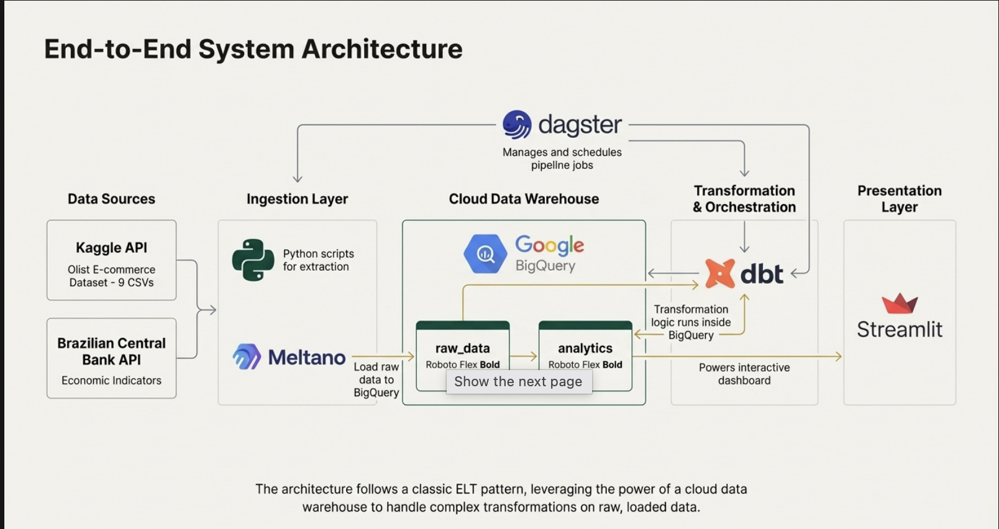

# Brazilian Sales Analytics
## Visual Documentation for Assessment

---
## System Architecture Diagram


## 📊 System Architecture Overview

```
┌───────────────────────────────────────────────────────────────────────────┐
│                         DATA ENGINEERING PIPELINE                          │
│              Brazilian Sales + Economic Indicators Analysis                │
└───────────────────────────────────────────────────────────────────────────┘


                              DATA SOURCES
┌──────────────────────────────┐    ┌──────────────────────────────┐
│      PostgreSQL Database     │    │   Brazilian Central Bank     │
│      (Local Server)          │    │   REST API (BCB)             │
├──────────────────────────────┤    ├──────────────────────────────┤
│ • 8 normalized tables        │    │ • USD/BRL exchange rate      │
│ • 100K orders (2016-2018)    │    │ • IPCA inflation index       │
│ • 32K products               │    │ • SELIC interest rate        │
│ • 99K customers              │    │ • Daily observations         │
│ • Brazilian e-commerce       │    │ • JSON response format       │
└──────────┬───────────────────┘    └───────────┬──────────────────┘
           │                                    │
           │  EXTRACTION LAYER                  │
           │                                    │
    ┌──────▼────────┐                   ┌──────▼────────┐
    │    Meltano    │                   │ Python Script │
    │    ELT Tool   │                   │   requests    │
    ├───────────────┤                   ├───────────────┤
    │ tap-postgres  │                   │  API calls    │
    │      ↓        │                   │  Transform    │
    │target-bigquery│                   │  Load to BQ   │
    └──────┬────────┘                   └──────┬────────┘
           │                                    │
           └──────────────┬─────────────────────┘
                          │
            ┌─────────────▼──────────────┐
            │   Google BigQuery          │
            │   Data Warehouse (Cloud)   │
            ├────────────────────────────┤
            │ Dataset: brazilian_sales   │
            │ • public-orders (99K)      │
            │ • public-Order_Items (112K)│
            │ • public-products (32K)    │
            │ • public-Customers (99K)   │
            │ • public-order_payments    │
            │ • bcb_economic_indicators  │
            │                            │
            │ Total: 450K rows, 53 MB    │
            └─────────────┬──────────────┘
                          │
            ┌─────────────▼──────────────┐
            │    dbt Transformation      │
            │    (Data Build Tool)       │
            ├────────────────────────────┤
            │ STAGING LAYER (5 models)   │
            │ • stg_orders               │
            │ • stg_order_items          │
            │ • stg_customers            │
            │ • stg_products             │
            │ • stg_bcb_indicators       │
            │         ↓                  │
            │ MART LAYER (4 fact tables) │
            │ • fct_customer_purchases   │
            │ • fct_category_performance │
            │ • fct_geographic_sales     │
            │ • fct_orders_with_economics│
            │                            │
            │ Tests: 20+ data quality    │
            └─────────────┬──────────────┘
                          │
            ┌─────────────▼──────────────┐
            │ BigQuery Analytics Dataset │
            │ brazilian_sales_marts      │
            ├────────────────────────────┤
            │ 285K rows across 4 tables  │
            │ Pre-joined, denormalized   │
            │ Optimized for queries      │
            └─────────────┬──────────────┘
                          │
                          │
    ┌─────────────────────┼─────────────────────┐
    │                     │                     │
    ▼                     ▼                     ▼
┌─────────┐        ┌──────────┐         ┌──────────┐
│Streamlit│        │ Business │         │ API/BI   │
│Dashboard│        │ Analysts │         │ Tools    │
└─────────┘        └──────────┘         └──────────┘


                    ORCHESTRATION LAYER
┌───────────────────────────────────────────────────────────────┐
│                    Dagster (Workflow Engine)                   │
├───────────────────────────────────────────────────────────────┤
│ Assets (8): bcb_indicators, postgres_data, staging, marts     │
│ Jobs (4): daily_full_pipeline, economic_update, quality_check │
│ Schedules (4): 6 AM daily, 2 PM economic, hourly tests        │
│ Sensors (2): Data freshness, table modification triggers      │
│ Monitoring: Logs, metadata, execution history, alerts         │
└───────────────────────────────────────────────────────────────┘


                    DEPLOYMENT LAYER
┌───────────────────────────────────────────────────────────────┐
│                Docker Containerization                         │
├───────────────────────────────────────────────────────────────┤
│                                                                │
│  ┌─────────────┐   ┌─────────────┐   ┌─────────────┐        │
│  │ Dashboard   │   │  Dagster    │   │    dbt      │        │
│  │ Container   │   │ Container   │   │  Container  │        │
│  ├─────────────┤   ├─────────────┤   ├─────────────┤        │
│  │ Streamlit   │   │ Orchestrator│   │ Transforms  │        │
│  │ Port: 8501  │   │ Port: 3000  │   │ Manual runs │        │
│  │ 800 MB      │   │ 1.2 GB      │   │ 600 MB      │        │
│  └─────────────┘   └─────────────┘   └─────────────┘        │
│                                                                │
│  Orchestrated with: docker-compose.yml                        │
│  Deploy to: Local, GCP Cloud Run, AWS ECS, Azure             │
└───────────────────────────────────────────────────────────────┘
```

---

## 🔄 Data Flow Diagram

```
 TIME: 6:00 AM (Daily Schedule Trigger)
 ═══════════════════════════════════════════════════════════════════

 STEP 1: PARALLEL EXTRACTION (~10 minutes total)
 ┌────────────────────────────────┐  ┌────────────────────────────┐
 │  Extract PostgreSQL Sales      │  │  Extract BCB Economic Data │
 │                                │  │                            │
 │  Meltano: tap-postgres →       │  │  Python: bcb_extractor.py  │
 │           target-bigquery      │  │          ↓                 │
 │      ↓                         │  │  API calls to BCB          │
 │  5 tables → BigQuery           │  │          ↓                 │
 │  • orders (99K)                │  │  Transform JSON            │
 │  • order_items (112K)          │  │          ↓                 │
 │  • products (32K)              │  │  Load to BigQuery          │
 │  • customers (99K)             │  │  3 indicators (2.7K rows)  │
 │  • payments (103K)             │  │                            │
 │                                │  │                            │
 │  Duration: ~10 minutes         │  │  Duration: ~5 minutes      │
 └────────────┬───────────────────┘  └────────────┬───────────────┘
              │                                   │
              └──────────────┬────────────────────┘
                             │
                             ▼
 ═══════════════════════════════════════════════════════════════════
 STEP 2: BUILD STAGING LAYER (~2 minutes)
 ┌───────────────────────────────────────────────────────────────┐
 │  dbt run --select staging                                     │
 │                                                                │
 │  Create 5 staging views:                                      │
 │  • stg_orders          Clean, filter cancelled orders         │
 │  • stg_order_items     Type conversions, nulls removed        │
 │  • stg_customers       Standardize addresses                  │
 │  • stg_products        Remove null categories                 │
 │  • stg_bcb_indicators  Date conversions, unit standardization │
 │                                                                │
 │  Output: 5 views (materialized as views for speed)            │
 └────────────────────────────┬──────────────────────────────────┘
                              │
                              ▼
 ═══════════════════════════════════════════════════════════════════
 STEP 3: BUILD MART LAYER (~10 minutes)
 ┌───────────────────────────────────────────────────────────────┐
 │  dbt run --select marts                                       │
 │                                                                │
 │  Create 4 fact tables:                                        │
 │                                                                │
 │  1. fct_customer_purchases_economics (99K rows)               │
 │     Join: orders + order_items + customers + BCB indicators   │
 │     Logic: Calculate total spend, add exchange rate           │
 │                                                                │
 │  2. fct_category_performance_economics (11.5K rows)           │
 │     Join: products + order_items + orders + BCB               │
 │     Logic: Aggregate by category + month, revenue in USD/BRL  │
 │     Feature: Exchange rate period classification              │
 │                                                                │
 │  3. fct_geographic_sales_economics (57K rows)                 │
 │     Join: customers + orders + products + BCB                 │
 │     Logic: Aggregate by state + city + month                  │
 │     Feature: Currency strength indicator                      │
 │                                                                │
 │  4. fct_orders_with_economics (99K rows)                      │
 │     Join: orders + BCB indicators                             │
 │     Logic: Enrich each order with economic context            │
 │                                                                │
 │  Output: 4 tables in brazilian_sales_marts dataset            │
 │  Total: 285K rows                                             │
 └────────────────────────────┬──────────────────────────────────┘
                              │
                              ▼
 ═══════════════════════════════════════════════════════════════════
 STEP 4: RUN DATA QUALITY TESTS (~3 minutes)
 ┌───────────────────────────────────────────────────────────────┐
 │  dbt test                                                      │
 │                                                                │
 │  Run 20+ tests:                                               │
 │  • Uniqueness: Primary keys are unique                        │
 │  • Not-null: Critical fields have no nulls                    │
 │  • Referential: Foreign keys exist in parent tables           │
 │  • Range: Numeric values within expected bounds               │
 │  • Business logic: Custom validations                         │
 │                                                                │
 │  Result: PASS=20, WARN=0, ERROR=0 ✅                          │
 └────────────────────────────┬──────────────────────────────────┘
                              │
                              ▼
 ═══════════════════════════════════════════════════════════════════
 STEP 5: REFRESH DASHBOARD CACHE (~1 second)
 ┌───────────────────────────────────────────────────────────────┐
 │  Create timestamp file: /tmp/streamlit_refresh.txt            │
 │                                                                │
 │  Streamlit dashboard detects file → clears query cache        │
 │  Next user request → fresh data from BigQuery                 │
 └────────────────────────────┬──────────────────────────────────┘
                              │
                              ▼
 ═══════════════════════════════════════════════════════════════════
 STEP 6: GENERATE EXECUTION REPORT (~1 second)
 ┌───────────────────────────────────────────────────────────────┐
 │  Query BigQuery for metadata                                  │
 │  • Row counts per table                                       │
 │  • Execution duration                                         │
 │  • Test results                                               │
 │                                                                │
 │  Generate summary:                                            │
 │  "Pipeline completed successfully in 30 minutes"              │
 │  "Processed 450K source rows → 285K mart rows"                │
 │  "All 20 tests passed"                                        │
 └───────────────────────────────────────────────────────────────┘

 ═══════════════════════════════════════════════════════════════════
 PIPELINE COMPLETE: 10:30 AM (Total duration: ~30 minutes)
 ═══════════════════════════════════════════════════════════════════

 USER ACCESS:
 • Dashboard updated with fresh data
 • Dagster UI shows successful run with metadata
 • BigQuery marts ready for ad-hoc queries
```

---

## 🎯 Dagster Asset Dependency Graph

```
                    ASSET DEPENDENCY GRAPH
                (Dagster Orchestration Logic)

┌────────────────────────────────────────────────────────────────┐
│                     EXTRACTION ASSETS                           │
│                     (Run in Parallel)                           │
└────────────────────────────────────────────────────────────────┘

    ┌─────────────────────────┐      ┌──────────────────────────┐
    │ postgres_sales_data     │      │ bcb_economic_indicators  │
    ├─────────────────────────┤      ├──────────────────────────┤
    │ • Runs Meltano          │      │ • Calls BCB API          │
    │ • Extracts 5 tables     │      │ • Extracts 3 series      │
    │ • Loads to BigQuery     │      │ • Loads to BigQuery      │
    │ Duration: 10 min        │      │ Duration: 5 min          │
    └────────┬────────────────┘      └──────────┬───────────────┘
             │                                  │
             └──────────────┬───────────────────┘
                            │
             ┌──────────────▼───────────────┐
             │                              │
┌────────────▼───────────────────────────────▼─────────────────┐
│                   STAGING ASSET                               │
└───────────────────────────────────────────────────────────────┘

    ┌──────────────────────────────────────────┐
    │ dbt_staging_models                       │
    ├──────────────────────────────────────────┤
    │ Dependencies: BOTH extraction assets     │
    │ • Waits for postgres AND bcb completion  │
    │ • Runs: dbt run --select stg_*          │
    │ • Creates 5 staging views                │
    │ Duration: 2 min                          │
    └────────────────┬─────────────────────────┘
                     │
                     │
┌────────────────────▼──────────────────────────────────────────┐
│                   MART ASSET                                   │
└────────────────────────────────────────────────────────────────┘

    ┌──────────────────────────────────────────┐
    │ dbt_mart_models                          │
    ├──────────────────────────────────────────┤
    │ Dependencies: dbt_staging_models         │
    │ • Runs: dbt run --select fct_*          │
    │ • Creates 4 fact tables                  │
    │ • 285K rows total                        │
    │ Duration: 10 min                         │
    └────────────────┬─────────────────────────┘
                     │
                     │
┌────────────────────▼──────────────────────────────────────────┐
│                   QUALITY ASSET                                │
└────────────────────────────────────────────────────────────────┘

    ┌──────────────────────────────────────────┐
    │ dbt_data_quality_tests                   │
    ├──────────────────────────────────────────┤
    │ Dependencies: dbt_mart_models            │
    │ • Runs: dbt test                         │
    │ • Validates 20+ assertions               │
    │ • Reports: PASS/WARN/FAIL                │
    │ Duration: 3 min                          │
    └────────────────┬─────────────────────────┘
                     │
                     │
┌────────────────────▼──────────────────────────────────────────┐
│                   CACHE ASSET                                  │
└────────────────────────────────────────────────────────────────┘

    ┌──────────────────────────────────────────┐
    │ streamlit_cache_refresh                  │
    ├──────────────────────────────────────────┤
    │ Dependencies: dbt_data_quality_tests     │
    │ • Creates timestamp trigger file         │
    │ • Signals dashboard to refresh           │
    │ Duration: <1 sec                         │
    └────────────────┬─────────────────────────┘
                     │
                     │
┌────────────────────▼──────────────────────────────────────────┐
│                   REPORT ASSET                                 │
└────────────────────────────────────────────────────────────────┘

    ┌──────────────────────────────────────────┐
    │ pipeline_execution_report                │
    ├──────────────────────────────────────────┤
    │ Dependencies: streamlit_cache_refresh    │
    │ • Queries BigQuery for metadata          │
    │ • Generates execution summary            │
    │ • Logs to Dagster                        │
    │ Duration: <1 sec                         │
    └──────────────────────────────────────────┘


MATERIALIZATION ORDER:
1. postgres_sales_data + bcb_economic_indicators (parallel)
2. dbt_staging_models (waits for both #1)
3. dbt_mart_models (waits for #2)
4. dbt_data_quality_tests (waits for #3)
5. streamlit_cache_refresh (waits for #4)
6. pipeline_execution_report (waits for #5)

TOTAL DURATION: ~30 minutes
```

---

## 📊 dbt Model Lineage

```
                      DBT MODEL LINEAGE
               (Transformation Dependencies)


         SOURCE TABLES (BigQuery: brazilian_sales)
┌─────────────────────────────────────────────────────────────────┐
│ public-orders | public-Order_Items | public-products |          │
│ public-Customers | public-order_payments |                      │
│ bcb_economic_indicators | public-product_category               │
└─────────────────────────────────────────────────────────────────┘
                             │
                             │ ref() / source()
                             ▼
┌─────────────────────────────────────────────────────────────────┐
│                     STAGING LAYER (Views)                        │
├─────────────────────────────────────────────────────────────────┤
│                                                                  │
│  ┌────────────┐  ┌─────────────┐  ┌─────────────┐             │
│  │stg_orders  │  │stg_order_   │  │stg_customers│             │
│  │            │  │   items     │  │             │             │
│  └──────┬─────┘  └──────┬──────┘  └──────┬──────┘             │
│         │               │                │                     │
│  ┌──────▼──────┐  ┌────▼──────────┐                           │
│  │stg_products │  │stg_bcb_       │                           │
│  │             │  │  indicators   │                           │
│  └─────────────┘  └───────────────┘                           │
│                                                                  │
│  Purpose: Clean, type, filter, standardize                     │
│  Materialization: Views (no storage overhead)                  │
└─────────────────────────────────────────────────────────────────┘
                             │
                             │ ref('stg_*')
                             ▼
┌─────────────────────────────────────────────────────────────────┐
│                      MART LAYER (Tables)                         │
├─────────────────────────────────────────────────────────────────┤
│                                                                  │
│  ┌───────────────────────────────────────────────────────────┐ │
│  │  fct_customer_purchases_economics                         │ │
│  ├───────────────────────────────────────────────────────────┤ │
│  │  Joins: stg_orders + stg_order_items +                   │ │
│  │         stg_customers + stg_bcb_indicators               │ │
│  │  Logic: Total customer spend + economic context           │ │
│  │  Rows: 99,441                                             │ │
│  └───────────────────────────────────────────────────────────┘ │
│                                                                  │
│  ┌───────────────────────────────────────────────────────────┐ │
│  │  fct_category_performance_economics                       │ │
│  ├───────────────────────────────────────────────────────────┤ │
│  │  Joins: stg_products + stg_order_items + stg_orders +    │ │
│  │         stg_bcb_indicators + product_category            │ │
│  │  Logic: Aggregate by category + month, classify exchange │ │
│  │  Rows: 11,500                                             │ │
│  └───────────────────────────────────────────────────────────┘ │
│                                                                  │
│  ┌───────────────────────────────────────────────────────────┐ │
│  │  fct_geographic_sales_economics                           │ │
│  ├───────────────────────────────────────────────────────────┤ │
│  │  Joins: stg_customers + stg_orders + stg_order_items +   │ │
│  │         stg_products + stg_bcb_indicators                │ │
│  │  Logic: Aggregate by state + city + category             │ │
│  │  Rows: 57,000                                             │ │
│  └───────────────────────────────────────────────────────────┘ │
│                                                                  │
│  ┌───────────────────────────────────────────────────────────┐ │
│  │  fct_orders_with_economics                                │ │
│  ├───────────────────────────────────────────────────────────┤ │
│  │  Joins: stg_orders + stg_bcb_indicators                  │ │
│  │  Logic: Enrich each order with USD/BRL, IPCA, SELIC     │ │
│  │  Rows: 99,441                                             │ │
│  └───────────────────────────────────────────────────────────┘ │
│                                                                  │
│  Purpose: Business logic, pre-joined, optimized for queries    │
│  Materialization: Tables (fast queries, denormalized)          │
│  Dataset: brazilian_sales_marts                                │
└─────────────────────────────────────────────────────────────────┘
                             │
                             │ Used by
                             ▼
┌─────────────────────────────────────────────────────────────────┐
│                    CONSUMPTION LAYER                             │
├─────────────────────────────────────────────────────────────────┤
│  • Streamlit Dashboard (interactive visualization)              │
│  • Business analysts (ad-hoc SQL queries)                       │
│  • API endpoints (future: programmatic access)                  │
│  • BI tools (future: Tableau, Looker integration)               │
└─────────────────────────────────────────────────────────────────┘


DATA QUALITY TESTS (20+):
┌─────────────────────────────────────────────────────────────────┐
│ • Uniqueness: category_name + order_month (11.5K unique combos) │
│ • Not-null: critical fields (order_count, revenue, exchange)    │
│ • Ranges: order_count > 0, revenue >= 0, 3.0 <= exchange <= 6.0│
│ • Business logic: exchange_rate_period in (Strong/Moderate/Weak)│
│ • Referential integrity: All foreign keys validated              │
└─────────────────────────────────────────────────────────────────┘
```

---

## 🐳 Docker Container Architecture

```
                   DOCKER DEPLOYMENT ARCHITECTURE


HOST MACHINE (Ubuntu Linux / macOS / Windows + WSL)
┌───────────────────────────────────────────────────────────────┐
│                                                                │
│  DOCKER ENGINE                                                 │
│  ┌──────────────────────────────────────────────────────────┐ │
│  │                                                           │ │
│  │  NETWORK: brazilian-sales-network (bridge)                │ │
│  │  ┌────────────────────────────────────────────────────┐  │ │
│  │  │                                                     │  │ │
│  │  │  CONTAINER 1: Streamlit Dashboard                  │  │ │
│  │  │  ┌──────────────────────────────────────────────┐  │  │ │
│  │  │  │ FROM python:3.10-slim                        │  │  │ │
│  │  │  │ WORKDIR /app                                 │  │  │ │
│  │  │  │                                              │  │  │ │
│  │  │  │ Installed:                                   │  │  │ │
│  │  │  │ • streamlit==1.29.0                         │  │  │ │
│  │  │  │ • plotly==5.18.0                            │  │  │ │
│  │  │  │ • google-cloud-bigquery==3.11.4             │  │  │ │
│  │  │  │ • pandas==2.0.3                             │  │  │ │
│  │  │  │                                              │  │  │ │
│  │  │  │ Files:                                       │  │  │ │
│  │  │  │ /app/streamlit_dashboard.py                 │  │  │ │
│  │  │  │ /app/credentials.json (mounted read-only)   │  │  │ │
│  │  │  │                                              │  │  │ │
│  │  │  │ Port: 8501 → Host: 8501                     │  │  │ │
│  │  │  │ Size: 800 MB                                 │  │  │ │
│  │  │  │ CPU: 1 core, RAM: 2 GB                      │  │  │ │
│  │  │  └──────────────────────────────────────────────┘  │  │ │
│  │  │                                                     │  │ │
│  │  │  CONTAINER 2: Dagster Orchestration              │  │ │
│  │  │  ┌──────────────────────────────────────────────┐  │  │ │
│  │  │  │ FROM python:3.10-slim                        │  │  │ │
│  │  │  │ WORKDIR /app                                 │  │  │ │
│  │  │  │                                              │  │  │ │
│  │  │  │ Installed:                                   │  │  │ │
│  │  │  │ • dagster==1.5.11                           │  │  │ │
│  │  │  │ • dagster-webserver==1.5.11                 │  │  │ │
│  │  │  │ • dagster-gcp==0.21.11                      │  │  │ │
│  │  │  │ • dbt-bigquery==1.10.3                      │  │  │ │
│  │  │  │                                              │  │  │ │
│  │  │  │ Files:                                       │  │  │ │
│  │  │  │ /app/dagster_project/                       │  │  │ │
│  │  │  │ /app/models/ (dbt project)                  │  │  │ │
│  │  │  │ /app/scripts/ (bcb_extractor.py)            │  │  │ │
│  │  │  │ /app/credentials.json (mounted)             │  │  │ │
│  │  │  │                                              │  │  │ │
│  │  │  │ Port: 3000 → Host: 3000                     │  │  │ │
│  │  │  │ Size: 1.2 GB                                 │  │  │ │
│  │  │  │ CPU: 2 cores, RAM: 4 GB                     │  │  │ │
│  │  │  │                                              │  │  │ │
│  │  │  │ Volume: dagster-storage (persistent)        │  │  │ │
│  │  │  └──────────────────────────────────────────────┘  │  │ │
│  │  │                                                     │  │ │
│  │  │  CONTAINER 3: dbt Transformations (manual)       │  │ │
│  │  │  ┌──────────────────────────────────────────────┐  │  │ │
│  │  │  │ FROM python:3.10-slim                        │  │  │ │
│  │  │  │ WORKDIR /dbt                                 │  │  │ │
│  │  │  │                                              │  │  │ │
│  │  │  │ Installed:                                   │  │  │ │
│  │  │  │ • dbt-core==1.10.15                         │  │  │ │
│  │  │  │ • dbt-bigquery==1.10.3                      │  │  │ │
│  │  │  │                                              │  │  │ │
│  │  │  │ Files:                                       │  │  │ │
│  │  │  │ /dbt/models/ (mounted)                      │  │  │ │
│  │  │  │ /dbt/dbt_project.yml                        │  │  │ │
│  │  │  │ /dbt/profiles.yml                           │  │  │ │
│  │  │  │                                              │  │  │ │
│  │  │  │ No exposed port (runs on-demand)             │  │  │ │
│  │  │  │ Size: 600 MB                                 │  │  │ │
│  │  │  │ Usage: docker-compose run dbt dbt run        │  │  │ │
│  │  │  └──────────────────────────────────────────────┘  │  │ │
│  │  │                                                     │  │ │
│  │  └─────────────────────────────────────────────────────┘  │ │
│  │                                                           │ │
│  │  VOLUMES:                                                 │ │
│  │  • dagster-storage (SQLite DB, logs, metadata)           │ │
│  │  • Mounted host files (live code updates)                │ │
│  │                                                           │ │
│  └──────────────────────────────────────────────────────────┘ │
│                                                                │
└───────────────────────────────────────────────────────────────┘


ORCHESTRATION: docker-compose.yml
┌───────────────────────────────────────────────────────────────┐
│ services:                                                      │
│   dashboard:  (Dockerfile.streamlit)   → Port 8501           │
│   dagster:    (Dockerfile.dagster)     → Port 3000           │
│   dbt:        (Dockerfile.dbt)         → Manual runs         │
│                                                                │
│ networks:                                                      │
│   brazilian-sales-network: bridge                             │
│                                                                │
│ volumes:                                                       │
│   dagster-storage: persistent SQLite DB                       │
└───────────────────────────────────────────────────────────────┘


DEPLOYMENT COMMANDS:
┌───────────────────────────────────────────────────────────────┐
│ # Build all containers                                         │
│ $ docker-compose build                                         │
│                                                                │
│ # Start all services (background)                             │
│ $ docker-compose up -d                                         │
│                                                                │
│ # View logs                                                    │
│ $ docker-compose logs -f                                       │
│                                                                │
│ # Run dbt manually                                             │
│ $ docker-compose run dbt dbt run                              │
│                                                                │
│ # Stop all services                                            │
│ $ docker-compose down                                          │
└───────────────────────────────────────────────────────────────┘


ACCESS POINTS:
┌───────────────────────────────────────────────────────────────┐
│ Dashboard:  http://localhost:8501                             │
│ Dagster UI: http://localhost:3000                             │
└───────────────────────────────────────────────────────────────┘
```

---

## ⚙️ Technology Stack Diagram

```
┌───────────────────────────────────────────────────────────────┐
│             TECHNOLOGY STACK - LAYER BY LAYER                  │
└───────────────────────────────────────────────────────────────┘

LAYER 1: DATA SOURCES
├── PostgreSQL 14.5
│   └── 8 normalized tables, 100K orders
└── BCB REST API (JSON)
    └── 3 economic indicators

LAYER 2: EXTRACTION
├── Meltano 3.3.0
│   ├── tap-postgres (Singer tap)
│   └── target-bigquery (Singer target)
└── Python 3.10
    ├── requests==2.31.0 (HTTP library)
    ├── pandas==2.0.3 (data manipulation)
    └── google-cloud-bigquery==3.11.4 (BQ client)

LAYER 3: DATA WAREHOUSE
└── Google BigQuery
    ├── Dataset: brazilian_sales (raw)
    ├── Dataset: brazilian_sales_marts (analytics)
    ├── Features: Clustering, future partitioning
    └── Cost: $0.25/month

LAYER 4: TRANSFORMATION
└── dbt 1.10.15
    ├── dbt-core (SQL templating, testing)
    ├── dbt-bigquery 1.10.3 (BQ adapter)
    ├── Jinja2 (templating engine)
    └── PyYAML (configuration parsing)

LAYER 5: VISUALIZATION
└── Streamlit 1.29.0
    ├── plotly==5.18.0 (interactive charts)
    ├── pandas==2.0.3 (data frames)
    └── google-cloud-bigquery (direct queries)

LAYER 6: ORCHESTRATION
└── Dagster 1.5.11
    ├── dagster-webserver (UI)
    ├── dagster-gcp==0.21.11 (GCP integration)
    └── dagster-dbt==0.21.11 (dbt integration)

LAYER 7: DEPLOYMENT
└── Docker 24.0.6
    ├── docker-compose (multi-container)
    ├── Python base images (python:3.10-slim)
    └── Volume management (persistent storage)

SUPPORTING TOOLS:
├── Git (version control)
├── VS Code (IDE)
├── Ubuntu 24 (development OS)
└── GCP Console (cloud management)
```

---

*End of Architecture Diagrams*

**For detailed implementation, refer to:**
- BRAZILIAN_SALES_COMPLETE_TECHNICAL_DOCUMENTATION.md
- Individual component guides (Dagster, Docker, dbt)
- Code files in project repository - Module_2_Brazilian-sales folder
