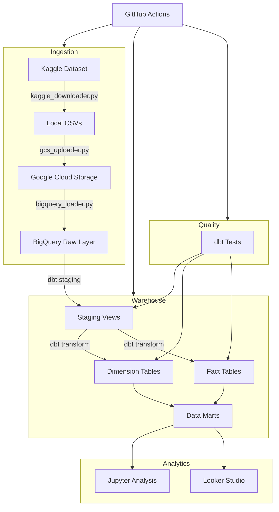

```mermaid
graph TD
    subgraph Ingestion
        Kaggle[Kaggle Dataset] -->|kaggle_downloader.py| Local[Local CSVs]
        Local -->|gcs_uploader.py| GCS[Google Cloud Storage]
        GCS -->|bigquery_loader.py| Raw[BigQuery Raw Layer]
    end

    subgraph Warehouse
        Raw -->|dbt staging| Staging[Staging Views]
        Staging -->|dbt transform| Dimensions[Dimension Tables]
        Staging -->|dbt transform| Facts[Fact Tables]
        Dimensions --> Marts[Data Marts]
        Facts --> Marts
    end

    subgraph Quality
        dbtTests[dbt Tests] --> Staging
        dbtTests --> Dimensions
        dbtTests --> Facts
    end

    subgraph Analytics
        Marts --> Notebook[Jupyter Analysis]
        Marts --> Dashboard[Looker Studio]
    end

    Orchestration[GitHub Actions] --> Ingestion
    Orchestration --> Warehouse
    Orchestration --> Quality
```
